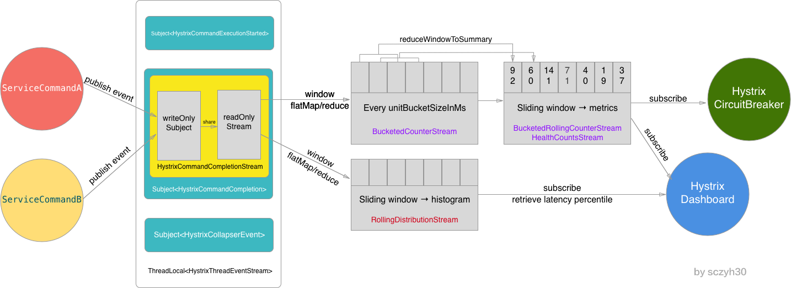

### 先从使用的配置说起吧
* hystrix的动态配置
    > Hystrix uses Archaius for the default implementation of properties for configuration.

    

* java的注解式使用
    [hystrix-javabica](https://github.com/Netflix/Hystrix/tree/master/hystrix-contrib/hystrix-javanica)

    - spring的aop配置
        ```java
        @Configuration
        public class HystrixConfiguration {

            @Bean
             public HystrixCommandAspect hystrixAspect() {
                return new HystrixCommandAspect();
             }
        }
        
       ```

    - 代码式的配置设置，可以动态地从其它配置服务设置（diamond，nacos等）
        > Javanica dynamically sets properties using Hystrix ConfigurationManager. For the example above Javanica behind the scenes performs next action:
    ```java
    ConfigurationManager.getConfigInstance().setProperty("hystrix.command.getUserById.execution.isolation.thread.timeoutInMilliseconds", "500");
    
    ```

* HystrixCircuitBreaker熔断器的code
    > Hystrix 和 Sentinel 的实时指标数据统计实现都是基于滑动窗口的。Hystrix 1.5 之前的版本是通过环形数组实现的滑动窗口，通过锁配合 CAS 的操作对每个桶的统计信息进行更新。Hystrix 1.5 开始对实时指标统计的实现进行了重构，将指标统计数据结构抽象成了响应式流（reactive stream）的形式，方便消费者去利用指标信息。同时底层改造成了基于 RxJava 的事件驱动模式，在服务调用成功/失败/超时的时候发布相应的事件，通过一系列的变换和聚合最终得到实时的指标统计数据流，可以被熔断器或 Dashboard 消费。


    - HystrixCircuitBreaker.HystrixCircuitBreakerImpl的RxJava的窗口流订阅
        ```java
        private Subscription subscribeToStream() {
            /*
             * This stream will recalculate the OPEN/CLOSED status on every onNext from the health stream
             */
            return metrics.getHealthCountsStream()
                    .observe()
                    .subscribe(new Subscriber<HealthCounts>() {
                        @Override
                        public void onCompleted() {

                        }

                        @Override
                        public void onError(Throwable e) {

                        }

                        @Override
                        public void onNext(HealthCounts hc) {
                            // check if we are past the statisticalWindowVolumeThreshold
                            if (hc.getTotalRequests() < properties.circuitBreakerRequestVolumeThreshold().get()) {
                                // we are not past the minimum volume threshold for the stat window,
                                // so no change to circuit status.
                                // if it was CLOSED, it stays CLOSED
                                // if it was half-open, we need to wait for a successful command execution
                                // if it was open, we need to wait for sleep window to elapse
                            } else {
                                if (hc.getErrorPercentage() < properties.circuitBreakerErrorThresholdPercentage().get()) {
                                    //we are not past the minimum error threshold for the stat window,
                                    // so no change to circuit status.
                                    // if it was CLOSED, it stays CLOSED
                                    // if it was half-open, we need to wait for a successful command execution
                                    // if it was open, we need to wait for sleep window to elapse
                                } else {
                                    // our failure rate is too high, we need to set the state to OPEN
                                    if (status.compareAndSet(Status.CLOSED, Status.OPEN)) {
                                        circuitOpened.set(System.currentTimeMillis());
                                    }
                                }
                            }
                        }
                    });
        }
        
        ```
    - metrics.getHealthCountsStream().observe()这个指标信息流，Observable的构造有下面两处

        ```json
        "circuitBreaker": {
                    "circuitBreaker.requestVolumeThreshold": "1000",
                    "circuitBreaker.errorThresholdPercentage": "80",
                    "circuitBreaker.forceOpen": "false"
                },
        
        ```
        1. BucketedRollingCounterStream的构造方法
            ```java
            this.sourceStream = bucketedStream      //stream broken up into buckets
                .window(numBuckets, 1)          //emit overlapping windows of buckets
                .flatMap(reduceWindowToSummary) //convert a window of bucket-summaries into a single summary
                .doOnSubscribe(new Action0() {
                    @Override
                    public void call() {
                        isSourceCurrentlySubscribed.set(true);
                    }
                })
                .doOnUnsubscribe(new Action0() {
                    @Override
                    public void call() {
                        isSourceCurrentlySubscribed.set(false);
                    }
                })
                .share()                        //multiple subscribers should get same data
                .onBackpressureDrop();          //if there are slow consumers, data should not buffer
            
            ```
        2. BucketedCounterStream
            ```java
            this.bucketedStream = Observable.defer(new Func0<Observable<Bucket>>() {
                @Override
                 public Observable<Bucket> call() {
                        return inputEventStream
                        .observe()
                        .window(bucketSizeInMs, TimeUnit.MILLISECONDS) //bucket it by the counter window so we can emit to the next operator in time chunks, not on every OnNext
                        .flatMap(reduceBucketToSummary)                //for a given bucket, turn it into a long array containing counts of event types
                        .startWith(emptyEventCountsToStart);           //start it with empty arrays to make consumer logic as generic as possible (windows are always full)
                 }
            });
            
            ```

        - 
* 其它
    - 滑动窗口
        1. tcp滑动窗口
            
        2. sentinel:默认的实现是基于 LeapArray 的滑动窗口
            
            
        3. RxJava:Observable<T>#window()
        