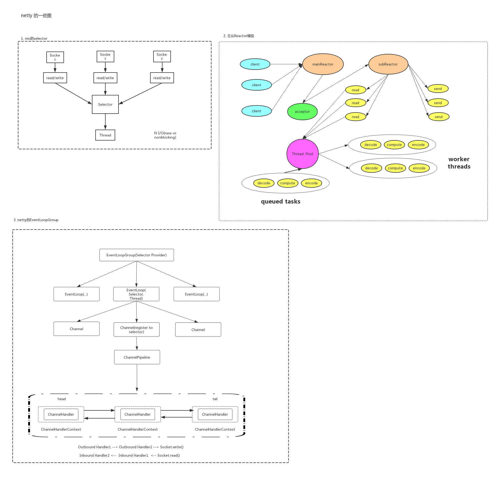

## 1.什么是netty
- > Netty is an asynchronous event-driven network application framework for rapid development of maintainable high performance protocol servers & clients.

- 异步：每个netty的出站i/o操作都将返回一个ChannelFuture;也就是说，它们都不阻塞。

- 事件驱动：发生事件，主线程把事件放入事件队列，在另外线程不断循环消费事件列表中的事件，调用事件对应的处理逻辑处理事件。

- 在netty4中，所有的i/o操作和事件都由已经被分配给了EventLoop的那个thread来处理；

- EventLoop本身只由一个线程驱动，其处理一个channel的所有i/o事件，并且在该EventLoop的整个生命周期内都不会改变。这个简单而强大的设计消除了你可能有的在ChannelHandler实现中需要进行同步的顾虑。（简单就是美）

## 2.来！看图
- 

## 3.netty一些代码
- 零拷贝应用，FileRegion这个接口，Windows惨遭diss.       
```java

    /** A region of a file that is sent via a {@link Channel} which supports
    * <a href="http://en.wikipedia.org/wiki/Zero-copy">zero-copy file transfer</a>.
    *
    * <h3>Upgrade your JDK / JRE</h3>
    *
    * {@link FileChannel#transferTo(long, long, WritableByteChannel)} has at least
    * four known bugs in the old versions of Sun JDK and perhaps its derived ones.
    * Please upgrade your JDK to 1.6.0_18 or later version if you are going to use
    * zero-copy file transfer.
    * <h3>Check your operating system and JDK / JRE</h3>
    *
    * If your operating system (or JDK / JRE) does not support zero-copy file
    * transfer, sending a file with {@link FileRegion} might fail or yield worse
    * performance.  For example, sending a large file doesn't work well in Windows.
    *
    * <h3>Not all transports support it</h3>
    */
    public interface FileRegion extends ReferenceCounted {

        /**
        * Returns the offset in the file where the transfer began.
        */
        long position();

    
        /**
        * Returns the bytes which was transferred already.
        */
        long transferred();

        /**
        * Returns the number of bytes to transfer.
        */
        long count();

        /**
        * Transfers the content of this file region to the specified channel.
        *
        * @param target    the destination of the transfer
        * @param position  the relative offset of the file where the transfer
        *                  begins from.  For example, <tt>0</tt> will make the
        *                  transfer start from {@link #position()}th byte and
        *                  <tt>{@link #count()} - 1</tt> will make the last
        *                  byte of the region transferred.
        */
        long transferTo(WritableByteChannel target, long position) throws IOException;   
    }
```

## 4.netty一些应用
- dubbo的dubbo协议默认用netty做传输层，单一长连接和NIO异步通讯，适合于小数据量大并发的服务调用，以及服务消费者机器数远大于提供者的情况。  
    * 服务端NettyServer的实现  
    ```java
    public class NettyServer extends AbstractServer implements Server {

        @Override
        protected void doOpen() throws Throwable {
        bootstrap = new ServerBootstrap();

        bossGroup = new NioEventLoopGroup(1, new DefaultThreadFactory("NettyServerBoss", true));
        workerGroup = new NioEventLoopGroup(getUrl().getPositiveParameter(Constants.IO_THREADS_KEY, Constants.DEFAULT_IO_THREADS),
                new DefaultThreadFactory("NettyServerWorker", true));

        final NettyServerHandler nettyServerHandler = new NettyServerHandler(getUrl(), this);
        channels = nettyServerHandler.getChannels();

        bootstrap.group(bossGroup, workerGroup)
                .channel(NioServerSocketChannel.class)
                .childOption(ChannelOption.TCP_NODELAY, Boolean.TRUE)
                .childOption(ChannelOption.SO_REUSEADDR, Boolean.TRUE)
                .childOption(ChannelOption.ALLOCATOR, PooledByteBufAllocator.DEFAULT)
                .childHandler(new ChannelInitializer<NioSocketChannel>() {
                    @Override
                    protected void initChannel(NioSocketChannel ch) throws Exception {
                        NettyCodecAdapter adapter = new NettyCodecAdapter(getCodec(), getUrl(), NettyServer.this);
                        ch.pipeline()//.addLast("logging",new LoggingHandler(LogLevel.INFO))//for debug
                                .addLast("decoder", adapter.getDecoder())
                                .addLast("encoder", adapter.getEncoder())
                                .addLast("handler", nettyServerHandler);
                    }
                });
        // bind
        ChannelFuture channelFuture = bootstrap.bind(getBindAddress());
        channelFuture.syncUninterruptibly();
        channel = channelFuture.channel();

        }
    }
    ```

    * NettyServerHandler的实现  
    ```java  
    @io.netty.channel.ChannelHandler.Sharable
    public class NettyServerHandler extends ChannelDuplexHandler {
        @Override
        public void channelActive(ChannelHandlerContext ctx) throws Exception {

        }

        @Override
        public void channelInactive(ChannelHandlerContext ctx) throws Exception {
        
        }

        @Override
        public void channelRead(ChannelHandlerContext ctx, Object msg) throws Exception {
            NettyChannel channel = NettyChannel.getOrAddChannel(ctx.channel(), url, handler);
            try {
                handler.received(channel, msg);
            } finally {
                NettyChannel.removeChannelIfDisconnected(ctx.channel());
            }
        }

        @Override
        public void write(ChannelHandlerContext ctx, Object msg, ChannelPromise promise) throws Exception {
            super.write(ctx, msg, promise);
            NettyChannel channel = NettyChannel.getOrAddChannel(ctx.channel(), url, handler);
            try {
                handler.sent(channel, msg);
            } finally {
                NettyChannel.removeChannelIfDisconnected(ctx.channel());
            }
        }
    }
    ```

- sentinel 控制台或者api的http请求(CloseableHttpAsyncClient httpClient),server端能用netty进行网络通讯(默认用的堵塞i/o，socket)。 
    * netty处理http的请求code如下，（可扩展为api网关的传输层）   
    ```java
    //服务启动是初始化netty server端
    public void start() throws Exception {
        EventLoopGroup bossGroup = new NioEventLoopGroup(1);
        EventLoopGroup workerGroup = new NioEventLoopGroup();
        try {
            ServerBootstrap b = new ServerBootstrap();
            b.group(bossGroup, workerGroup)
                .channel(NioServerSocketChannel.class)
                .childHandler(new HttpServerInitializer());
            int port;
        }
    }
    ```
    * http编解码，和http请求的业务处理    
    ```java
    public class HttpServerInitializer extends ChannelInitializer<SocketChannel> {
        @Override
        protected void initChannel(SocketChannel socketChannel) throws Exception {
            ChannelPipeline p = socketChannel.pipeline();

            p.addLast(new HttpRequestDecoder());
            p.addLast(new HttpObjectAggregator(1024 * 1024));
            p.addLast(new HttpResponseEncoder());

            p.addLast(new HttpServerHandler());
        }
    }
    ```
    * http请求处理handler         
    ```java   
    public class HttpServerHandler extends SimpleChannelInboundHandler<Object> {
        private final CodecRegistry codecRegistry = new CodecRegistry();

        @Override
        public void channelReadComplete(ChannelHandlerContext ctx) throws Exception {
            ctx.flush();
        }

        @Override
        protected void channelRead0(ChannelHandlerContext ctx, Object msg) throws Exception {
    
        FullHttpRequest httpRequest = (FullHttpRequest)msg;
        //ignore

        FullHttpResponse httpResponse = new DefaultFullHttpResponse(
            HttpVersion.HTTP_1_1,
            HttpResponseStatus.valueOf(statusCode),
            Unpooled.copiedBuffer(message, Charset.forName(SentinelConfig.charset())));

        httpResponse.headers().set("Content-Type", "text/plain; charset=" + SentinelConfig.charset());
        ctx.write(httpResponse);
        ctx.writeAndFlush(Unpooled.EMPTY_BUFFER).addListener(ChannelFutureListener.CLOSE);
        }
    ```
    

- redisson的 发送redis commond 到redis服务器，用netty发送，redisClient的创建
    ```java
    //redis client创建netty bootstrap
    public class RedisClient {

        private Bootstrap createBootstrap(RedisClientConfig config, Type type) {
        Bootstrap bootstrap = new Bootstrap()
                        .resolver(config.getResolverGroup())
                        .channel(config.getSocketChannelClass())
                        .group(config.getGroup());

        bootstrap.handler(new RedisChannelInitializer(bootstrap, config, this, channels, type));
        bootstrap.option(ChannelOption.CONNECT_TIMEOUT_MILLIS, config.getConnectTimeout());
        bootstrap.option(ChannelOption.SO_KEEPALIVE, config.isKeepAlive());
        bootstrap.option(ChannelOption.TCP_NODELAY, config.isTcpNoDelay());
        return bootstrap;
        }
    }
    ```

    ```java
    //channel初始化一些handler,RedisConnectionHandler这个连接handler，可以池化redis connect
    public class RedisChannelInitializer extends ChannelInitializer<Channel> {
        @Override
        protected void initChannel(Channel ch) throws Exception {
            initSsl(config, ch);
            if (type == Type.PLAIN) {
                ch.pipeline().addLast(new RedisConnectionHandler(redisClient));
            } else {
                ch.pipeline().addLast(new RedisPubSubConnectionHandler(redisClient));
            }
            
            ch.pipeline().addLast(
                connectionWatchdog,
                CommandEncoder.INSTANCE,
                CommandBatchEncoder.INSTANCE,
                new CommandsQueue());
            
            if (pingConnectionHandler != null) {
                ch.pipeline().addLast(pingConnectionHandler);
            }
            
            if (type == Type.PLAIN) {
                ch.pipeline().addLast(new CommandDecoder(config.getExecutor(), config.isDecodeInExecutor()));
            } else {
                ch.pipeline().addLast(new CommandPubSubDecoder(config.getExecutor(), config.isKeepPubSubOrder(), config.isDecodeInExecutor()));
            }
        }
    
    }
    
    ```
    ```java
    //netty的channel连接成功的话，注入redis connenction中
    public class RedisConnectionHandler extends BaseConnectionHandler<RedisConnection> {

        public RedisConnectionHandler(RedisClient redisClient) {
            super(redisClient);
        }
        
        @Override
        RedisConnection createConnection(ChannelHandlerContext ctx) {
            return new RedisConnection(redisClient, ctx.channel(), connectionPromise);
        }

    }

    ```
