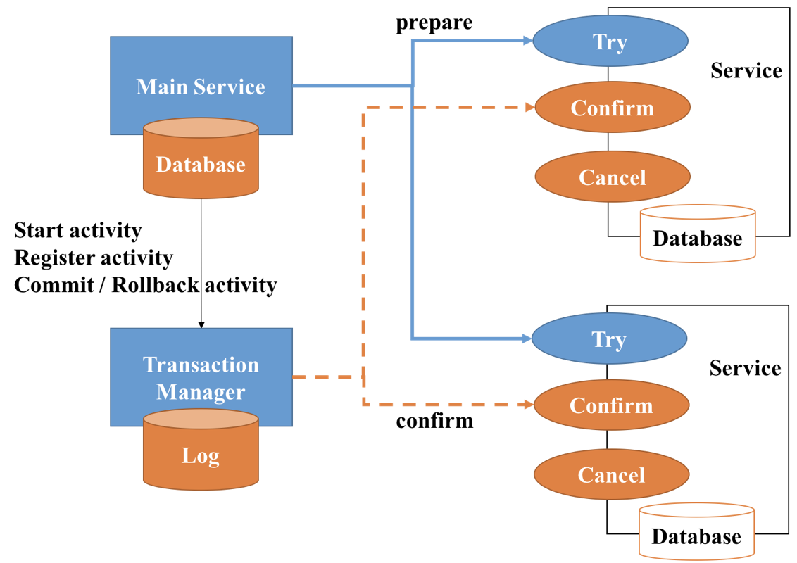

## 为什么需要分布式事务

- 还不是微服务化后，系统拆分，数据库那边也各种分库分表，原来可以依赖数据库的事务实现的ACID的特性也没啦，这种事务实现需要扩散到上层实现。

- 2PC 是几乎所有分布式事务算法的基础，后续的分布式事务算法几乎都由此改进而来，其优缺点非常明显：
    * 
    * 优点：在于已经有较为成熟的实现方案，比如 XA。
    * 缺点：XA 是一个阻塞协议。服务在投票后需要等待协调器的决定，此时服务会阻塞并锁定资源。由于其阻塞机制和最差时间复杂度高， 因此，这种设计不能适应随着事务涉及的服务数量增加而扩展的需要，很难用于并发较高以及子事务声明周期较长 (long-running transactions) 的分布式服务中。

- 

## 分布式事务的实现
- 首先谈谈什么是XA事务
    * X/A在我看来，就是X/open这个组织对分布式事务实现提供了标准的接口，具体可以看 [c193](../file/c193-xa.pdf)，（标准协议已经帮你们抽象好了接口，具体实现那就看你们的了，斜眼笑）

    * XA事务就是两阶段提交的一种实现方式
    * XA规范主要定义了事务管理器TM，和资源管理器RM之间的接口
        - 根据2PC的规范，将一次事务分割成两个阶段
            1. prepare阶段
                - TM向所有RM发送prepare指令，RM接受到指令后执行数据修改和日志记录等操作，然后返回 可以提交/不可提交 给TM
            2. commit阶段
                - TM接受到所有RM的prepare结果,如果有RM返回是 不可提交 或者超时，那么向所有RM发送ROLLBACK命令;如果所有RM都返回可以提交，那么向所有RM发送COMMIT命令          

- mysql xa事务支持
    * [mysql官方wiki](https://dev.mysql.com/doc/refman/5.7/en/xa.html?spm=a2c4e.11153940.blogcont283392.10.17041284mU5BRh)

    * Support for XA transactions is available for the InnoDB storage engine. 

    * 通常来说，都是通过编程语言来完成分布式事务的操作的。当前Java的JTA（JavaTransactionAPI）可以很好地支持MySQL的分布式事务，需要使用分布式事务应该认真参考其API。

- rocketmq事务消息

    * 官方先行，[rocket Transactional Message](https://rocketmq.apache.org/rocketmq/the-design-of-transactional-message/)

    * 一个TransactionListenerImpl sample，override本地事务执行，和本地事务状态检查。  
       
    ```java
    public class TransactionListenerImpl implements TransactionListener {
        private AtomicInteger transactionIndex = new AtomicInteger(0);

        private ConcurrentHashMap<String, Integer> localTrans = new ConcurrentHashMap<>();

        @Override
        public LocalTransactionState executeLocalTransaction(Message msg, Object arg) {
            int value = transactionIndex.getAndIncrement();
            int status = value % 3;
            localTrans.put(msg.getTransactionId(), status);
            return LocalTransactionState.UNKNOW;
        }

        @Override
        public LocalTransactionState checkLocalTransaction(MessageExt msg) {
            Integer status = localTrans.get(msg.getTransactionId());
            if (null != status) {
                switch (status) {
                    case 0:
                        return LocalTransactionState.UNKNOW;
                    case 1:
                        return LocalTransactionState.COMMIT_MESSAGE;
                    case 2:
                        return LocalTransactionState.ROLLBACK_MESSAGE;
                    default:
                        return LocalTransactionState.COMMIT_MESSAGE;
                }
            }
            return LocalTransactionState.COMMIT_MESSAGE;
        }
    }
    
    ```

    * 个人理解：rocket的事务消息，通过broker的消息log（在其中实现事务管理器tm的功能），保证了producer（local transaction）->mq 这两个model的事务特性,但consumer消费失败只能进行重试了。

    * 在RocketMQ事务消息如何使用的时候我们提到，如果消费失败怎么办？消费失败有2种，
        1. 第一种是超时了，我们重试即可，
        2. 第二种是真的处理失败了 ，rocketMq并没有实现自动回滚，如果失败率比较大，那么就是系统问题需要优化代码业务.
        3. 很多这块是通过人工介入以及T+1对账的以及补偿机制等。


- tcc的实现
    * TCC(Try-Confirm-Concel) 模型同样是一种补偿性事务，主要分为 Try：检查、保留资源，Confirm：执行事务，Concel：释放资源三个阶段，如下图所示：
    * 

    * 需要在service业务方提供try,cancel,confirm三个接口，使得业务代码复杂度陡升，补偿时也需要保证接口的幂等性，但相应的带来的也是业务灵活性。

- 分布式事务seata
    * [seata概览](https://github.com/seata/seata/wiki/%E6%A6%82%E8%A7%88)
    * 这个文档比较全，[seats wiki](https://github.com/seata/awesome-seata/tree/master/wiki/zh-cn)，（吐槽，seata的文档维护还有点乱）

    * AT 模式 基于 支持本地 ACID 事务 的 关系型数据库。

    * MT 模式，不依赖于底层数据资源的事务支持。
        - MT 模式的一个重要作用就是，可以把非关系型数据库的资源，通过 MT 模式分支的包装，纳入到全局事务的管辖中来。比如，Redis、HBase、RocketMQ 的事务消息等。
        - 这块暂时没看到具体实现，TCC也算是其中一种的。

    * 蚂蚁把TCC集成到了seata中，相对于传统的2pc，tcc事务可以只在try阶段持有lock，commit阶段可以异步执行。典型的例子是担保交易（dsc的288 202的冻结户，😄）。

## 现有的选择
* 开源的就看seata的迭代了，暂时还没有上生产的条件，关注就行了


