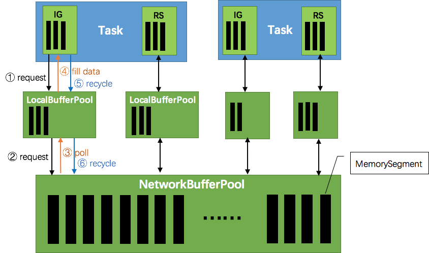

## 1. flink definition
- Apache Flink is a framework and distributed processing engine for stateful computations over unbounded and bounded data streams. 

- 

## 2. problems
- AggregateFunction.merge(),是多个task的AverageAccumulator（per key and window） merge吗？
    * stream(per key and window) ——> AverageAccumulator(state)。
    * 展示了Source并行度为1，FlatMap、KeyAggregation、Sink并行度均为2，最终以5个并行的线程来执行的优化过程。见👇flink graph
    * 当sink的并行度为1时，就涉及到了 AverageAccumulator的merge。

- Parallel Execution 为啥sink也能分片，在什么时候做merge的？
    *  result.print().setParallelism(3);
    *  result.writeAsText("～/logs/flink/wiki.txt").setParallelism(1);
    *  说到底还是Parallelism的问题，sink也能并行输出结果的，operator Parallelism > sink Parallelism, 是不是就要merge了？

- flink的时间窗口如果是长时间的，比如过去一年，state会存储窗口里所有数据吗？

## 3. 源码的阅读

- flink的backpressure实现
    * 

    * NettyServer 的waterMark设置
    ```java
		// Low and high water marks for flow control
		// hack around the impossibility (in the current netty version) to set both watermarks at
		// the same time:
		final int defaultHighWaterMark = 64 * 1024; // from DefaultChannelConfig (not exposed)
		final int newLowWaterMark = config.getMemorySegmentSize() + 1;
		final int newHighWaterMark = 2 * config.getMemorySegmentSize();
		if (newLowWaterMark > defaultHighWaterMark) {
			bootstrap.childOption(ChannelOption.WRITE_BUFFER_HIGH_WATER_MARK, newHighWaterMark);
			bootstrap.childOption(ChannelOption.WRITE_BUFFER_LOW_WATER_MARK, newLowWaterMark);
		} else { // including (newHighWaterMark < defaultLowWaterMark)
			bootstrap.childOption(ChannelOption.WRITE_BUFFER_LOW_WATER_MARK, newLowWaterMark);
			bootstrap.childOption(ChannelOption.WRITE_BUFFER_HIGH_WATER_MARK, newHighWaterMark);
		}
    ```
    
    * netty的最后一个ChannelInboundHandler:PartitionRequestQueue
    ```java
    @Override
	public void channelWritabilityChanged(ChannelHandlerContext ctx) throws Exception {
		writeAndFlushNextMessageIfPossible(ctx.channel());
	}

	private void writeAndFlushNextMessageIfPossible(final Channel channel) throws IOException {
        //是否可读，跟waterMark设置有关
		if (fatalError || !channel.isWritable()) {
			return;
		}

		// The logic here is very similar to the combined input gate and local
		// input channel logic. You can think of this class acting as the input
		// gate and the consumed views as the local input channels.

		BufferAndAvailability next = null;
		try {
			while (true) {
                // 从队列中获取可用reader
				NetworkSequenceViewReader reader = pollAvailableReader();

				// No queue with available data. We allow this here, because
				// of the write callbacks that are executed after each write.
				if (reader == null) {
					return;
				}
                ....
				....
				} else {
					// This channel was now removed from the available reader queue.
					// We re-add it into the queue if it is still available
					if (next.moreAvailable()) {
						registerAvailableReader(reader);
					}

					BufferResponse msg = new BufferResponse(
						next.buffer(),
						reader.getSequenceNumber(),
						reader.getReceiverId(),
						next.buffersInBacklog());

					// Write and flush and wait until this is done before
					// trying to continue with the next buffer.
                    // 注册一个回调，wirte成功后会递归进来，@See WriteAndFlushNextMessageIfPossibleListener
					channel.writeAndFlush(msg).addListener(writeListener);

					return;
				}
			}
		} catch (Throwable t) {
            ....
            ....
		}
	} 
    ```

- 内存管理
    * flink TaskManger就是一个jvm进程，进行task执行，堆内存组成如下：

    * 

        - Network Buffers: 一定数量的32KB大小的 buffer，主要用于数据的网络传输。在 TaskManager 启动的时候就会分配。默认数量是 2048 个，可以通过 taskmanager.network.numberOfBuffers 来配置。（阅读这篇文章了解更多Network Buffer的管理）
        - Memory Manager Pool: 这是一个由 MemoryManager 管理的，由众多MemorySegment组成的超大集合。Flink 中的算法（如 sort/shuffle/join）会向这个内存池申请 MemorySegment，将序列化后的数据存于其中，使用完后释放回内存池。默认情况下，池子占了堆内存的 70% 的大小。
        - Remaining (Free) Heap: 这部分的内存是留给用户代码以及 TaskManager 的数据结构使用的。因为这些数据结构一般都很小，所以基本上这些内存都是给用户代码使用的。从GC的角度来看，可以把这里看成的新生代，也就是说这里主要都是由用户代码生成的短期对象。

    * MemorySegment的javadoc
    ```java
    /**
    * This class represents a piece of memory managed by Flink.
    * The segment may be backed by heap memory (byte array) or by off-heap memory.
    *
    * <p>The methods for individual memory access are specialized in the classes
    * {@link org.apache.flink.core.memory.HeapMemorySegment} and
    * {@link org.apache.flink.core.memory.HybridMemorySegment}.
    * All methods that operate across two memory segments are implemented in this class,
    * to transparently handle the mixing of memory segment types.
    */
    @Internal
    public abstract class MemorySegment {

	/**
	 * The unsafe handle for transparent memory copied (heap / off-heap).
	 */
	@SuppressWarnings("restriction")
	protected static final sun.misc.Unsafe UNSAFE = MemoryUtils.UNSAFE;

    .......
    }
    ```     
        
- flink 架构以及graph拓扑
    * 

    * Flink 中的执行图可以分成四层：StreamGraph -> JobGraph -> ExecutionGraph -> 物理执行图。
    


