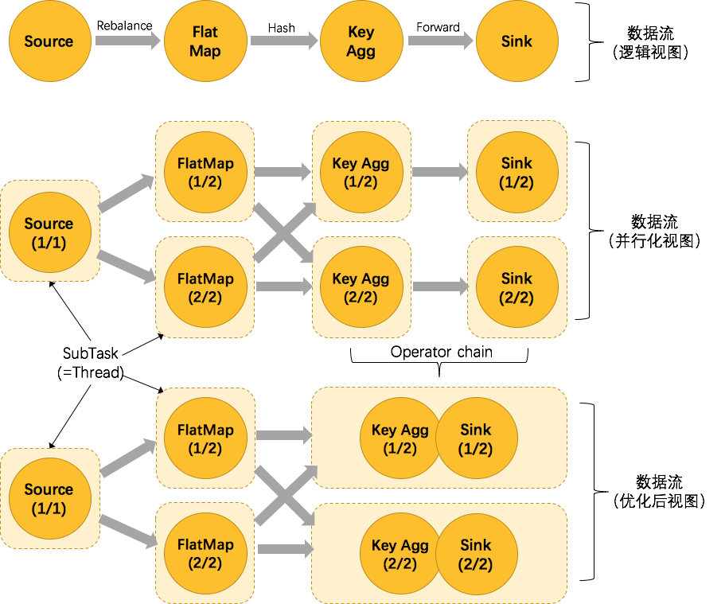

## 1. flink definition
- Apache Flink is a framework and distributed processing engine for stateful computations over unbounded and bounded data streams. 

- 

## 2. problems

- AggregateFunction.merge(),是多个task的AverageAccumulator（per key and window） merge吗？
    * stream(per key and window) ——> AverageAccumulator(state)。
    * 展示了Source并行度为1，FlatMap、KeyAggregation、Sink并行度均为2，最终以5个并行的线程来执行的优化过程。
    * 当sink的并行度为1时，就涉及到了 AverageAccumulator的merge。

- Parallel Execution 为啥sink也能分片，在什么时候做merge的？
    *  result.print().setParallelism(3);
    *  result.writeAsText("～/logs/flink/wiki.txt").setParallelism(1);
    *  说到底还是Parallelism的问题，sink也能并行输出结果的，operator Parallelism > sink Parallelism, 是不是就要merge了？

